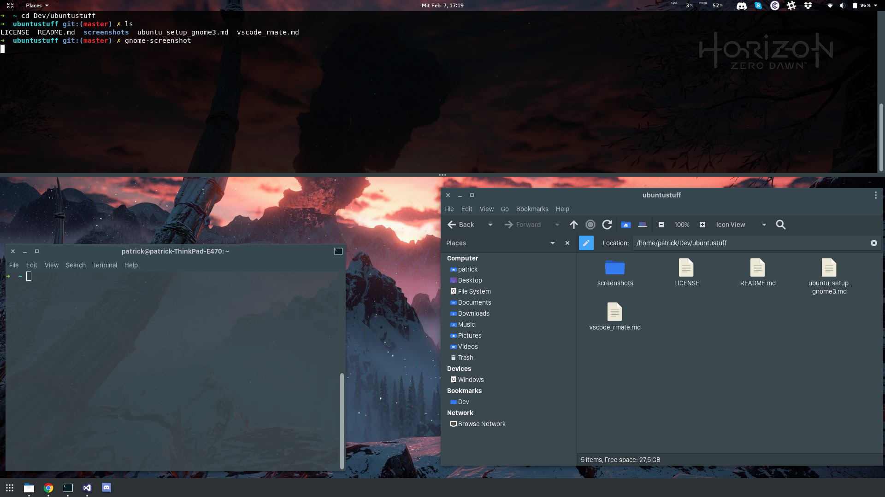

# Ubuntu 17.10 Setup with Gnome3 Desktop  

This is how it looks like:  


## Gnome3 

Install Gnome3 if you don't have already and get gnome tweak tool:
```
sudo apt install gnome-shell gnome-tweak-tool
```  

### Themes
[Flat-Remix](https://github.com/daniruiz/Flat-Remix-GNOME-theme) is used as base theme with the Flat-Remix icon theme. As GTK3 theme [Materia](https://github.com/nana-4/materia-theme) fits well to Flat-Remix theme. 

### Fonts
Im currently using the Fonts from OSX. You can get them [here](https://github.com/AppleDesignResources/SanFranciscoFont) and select them with Gnome-Tweak-Tool:  

> Window Title: "San Francisco Display Medium" Size 11  
> Interface: "San Francisco Display Regular" Size 11  
> Document: "San Francisco Text Regular" Size 11  
> Monospace: "Monospace Regular" Size 11  

### Extensions

Im using following extensions for gnome3:  
* [dash-to-dock](https://github.com/micheleg/dash-to-dock)  
* [system-monitor](https://github.com/paradoxxxzero/gnome-shell-system-monitor-applet)  
* [TopIcons](https://github.com/phocean/TopIcons-plus)  

Dash to dock is set to position at the bottom on all screens, with an Icon Size of 24 and panel mode on.  
On the appearance tab in the dash to dock settings make sure to set these options on:  
* Shrink the dash  
* Show window counter indicators  

## Applications
Filemanager: Caja, Dropdown Terminal: Guake, Spotlight: Cerebro  
You can get the first two via apt:  
```
sudo apt install caja guake
```
Cerebro can be found [here](https://cerebroapp.com/)  
To have cerebro launching with every login, add the appimage to startup applications.

## Intel, nVidia & Wayland  
Follow [this guide](https://www.pcsuggest.com/nvidia-optimus-ubuntu/) to setup nvidia with bumblebee after installing gnome3.  
With this you should be able to log in using gnome on wayland.  

## Fix sudo with wayland
create the file 'fixSudoWayland.sh' in your home directory (or some other place if you prefer) with following content:  
```
xhost +SI:localuser:root
```
To apply the fix automatically on every boot add this line to your .bashrc or .zshrc (or other shell rc..)
```
source ~/fixSudoWayland.sh
```

## zsh and .oh-my-zsh
```
sudo apt install zsh && chsh -s $(which zsh)
```
Guide for installing oh-my-zsh is [here](https://github.com/robbyrussell/oh-my-zsh)  

### custom entries for .zshrc (or .bashrc)
Coming from macOS these commands are nice to have as alias in the terminal: 'open' and 'cls'  
Add this to .zshrc or .bashrc:
```
alias cls="clear"

open() { 
	nohup caja "$1" </dev/null > /tmp/caja.log 2>&1 & 
} 
```
Note: Relace "caja" with your default file manager
